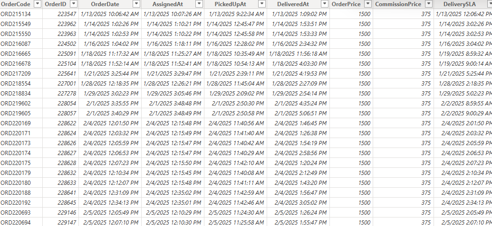
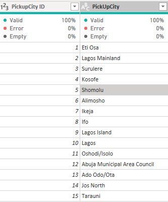
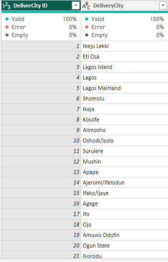
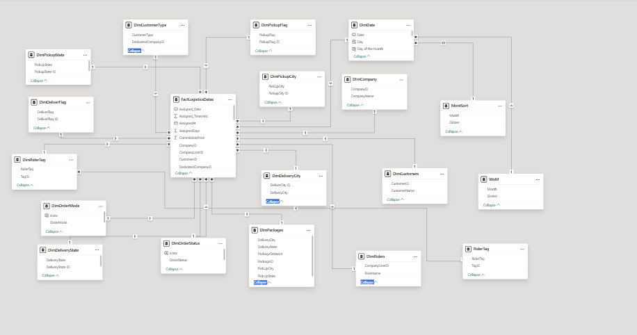
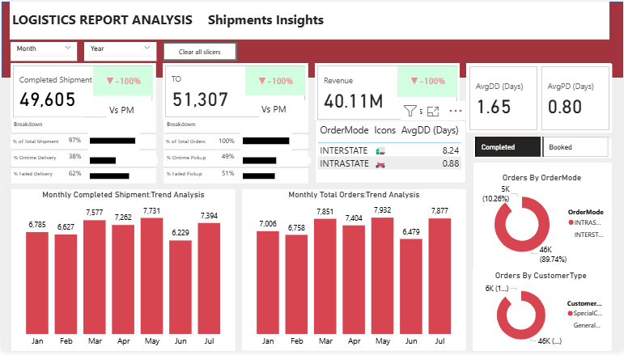
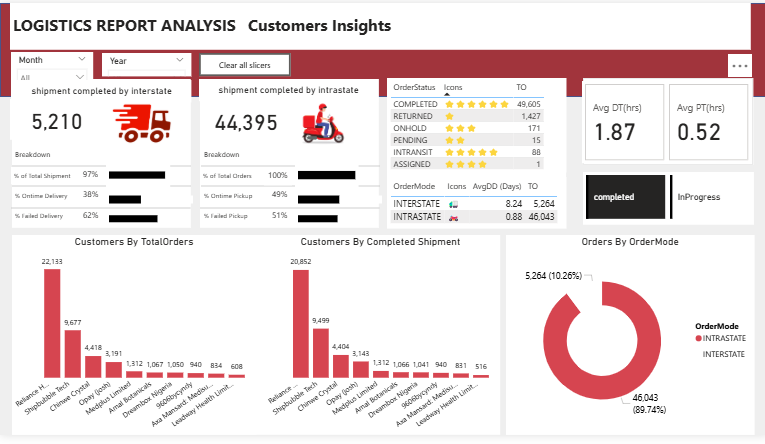
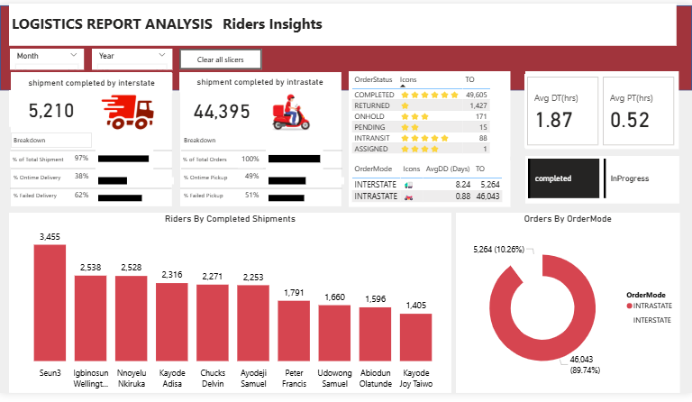
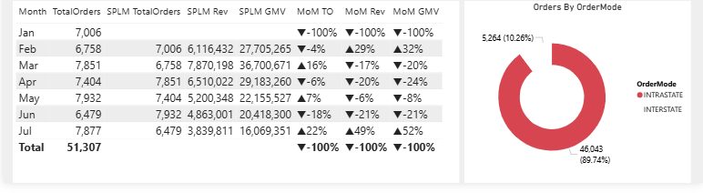

## Introduction
this project is basically a logistics company project which entails a large datasets ingested from the company internal database.
my experience as a data analyst working with a production datasets is quite amazing and full of learning and mistakes. this experience positively
shaped my data analyst journey as a junior data analsyt. furthermore the aim and objectives is discussed below

## Problem statements
1.	Calculate the total orders booked by customers
2.	Calculate the total completed shipment delivered to customers
3.	The Total revenue generated by the the company 
4.	Top 10 customers that used our services 
5.	Top 10 riders that executed completed orders
6.	Total intrastate orders booked by customers
7.	Total interstate orders booked by customers .
8.	Average order value for all orders.
9.	Average order value for intrastate.
10.Average order value for interstate.
11. Gross merchandise value .
12. Calculate the pickup compliance with respect to ontime pickup rate and failed pickup rate.
13. Calculate the delivery compliance with respect to failed delivery rate and ontime delivery rate.ng

## Skills / Concepts demonstrated
this is a fully-fledge powerbi project. The skill demonstrated is as follows:
- page navigation
- button
- filter
- dax
- bookmarking
- tooltips
- modelling
- quick measures

## Data collection
The relevant data is collected from the company internal database in which the tables involve are:
customers,orders,packages,company,companyusers,ridertag tables

## Data cleaning and data transformation
The data cleaning process was performed basically on package table referencing only the pickup city and delivery city 
and the cleaning was performed to some cities that are outside nigeria because of the company restriction to foreign shipments

## Data modelling 
The model use is star schema.
The data modelling process was performed basically among 18 dimension tables and 1 factable and was joined with one to many relationship

## Data Visualisation
The response and interactive of the visualization is displayed.
[here](https://app.powerbi.com/groups/me/reports/5332e05c-5f8c-4421-9d81-f34e5e7d44f7/4a92155ba92a0a8e01b8?experience=power-bi)

Order Analysis
this indicated total orders booked by customers between january to july 2025

Customers Analysis
this indicated customers that used our services between between january to july 2025

Riders Analysis
this indicated riders that executed completed orders between between january to july 2025

Month Over Month Analysis 
this indicated our monthly orders performance

## Data Measures
The key primary indicators is used to track the performance of the business overtime. this furthermore reveals the general strength and weakness
of the business. however the KPIs are calculated in data analysis expresssion (Dax) such as:
-Average order value
AOV = AVERAGE(FactLogisticsDatas[OrderPrice])
-Gross merchandise value
GMV = sum(FactLogisticsDatas[OrderPrice])
-Interstate AOV
InterAOV = CALCULATE([AOV],DimOrderMode[OrderMode ID] = 2)
-Intrastate AOV
IntraAOV = CALCULATE([AOV],DimOrderMode[OrderMode ID] = 1)
-Revenue 
Revenue = SUM(FactLogisticsDatas[CommissionPrice])
-TotalOrders
TotalOrder = COUNTROWS(FactLogisticsDatas)
-CompletedShipment 
Completed Shipment = CALCULATE([TotalOrder],FILTER(FactLogisticsDatas,FactLogisticsDatas[OrderStatus ID] = 1))
-Failed Delivery Rate(%)
FailedDeliver% = DIVIDE([FailedDeliver],[TotalDeliveries])
-Ontime Delivery Rate(%)
OntimeDelivery% = DIVIDE([OntimeDeliver],[TotalDeliveries]
-Failed Pickup Rate(%)
FailedPickup% = DIVIDE([FailedPickup],[TotalPickup])
-Ontime Pickup Rate(%)
OntimePickup% = DIVIDE([OntimePickup],[TotalPickup])

## Recommendations and conclusion
1. The company should focus more on customers that booked large volume of orders for customers retention rate
2. the company should focus on how they can improve on ontime effective delivery and ontime effective pickup
3. the company should focus on customers generating the most revenue
4. the company should focus on state with the most shipment

